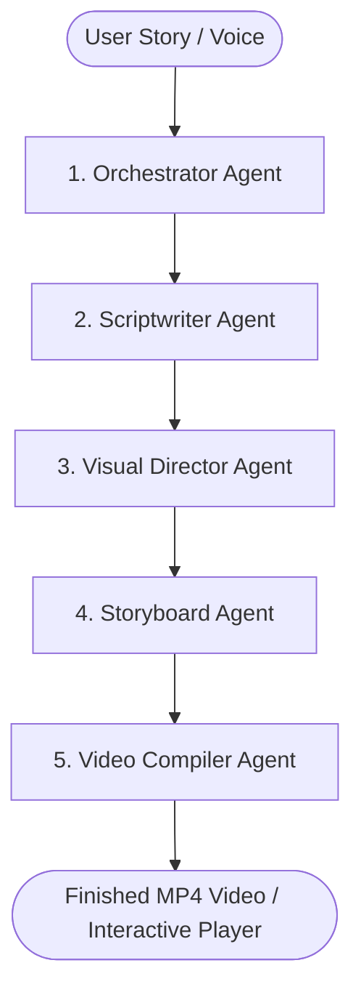

# Story-to-Video Multi-Agent System: High-Level Documentation

This document provides a concise overview of the architecture, key agents, text/speech ingestion pipeline, and bottleneck solutions for the Story-to-Video Agent.

---

## 1. Core Objective & Architecture

The system takes a free-form story (text or speech) and converts it into a structured visual script, a set of storyboard frames, and a final playable video presentation (with animated transitions and voiceover narration).

The system uses a **collaborative multi-agent pipeline** where specialized agents focus on distinct steps of the creative process:



---

## 2. Agent Roles

1. **Orchestrator Agent**: The pipeline supervisor. Manages user input, coordinates state transition between agents, ensures data validity, and handles system-wide seeds for reproducibility.
2. **Scriptwriter Agent**: The screenwriting specialist. Translates free-form, ambiguous story input into structured scenes, action descriptions, narration voiceovers, and character dialogues.
3. **Visual Director Agent**: The cinematic artist. Takes the script and designs visual compositions, selecting shot angles, camera movements (panning, zooming), styling presets, and pacing.
4. **Storyboard Agent**: The prompt designer. Translates visual descriptions into precise prompts for the image generation engine (Pollinations AI) and manages deterministic generation seeds.
5. **Video Compiler Agent**: The editor. Stitches the generated scene frames and synthesized audio narrations into a synchronized interactive theater and outputs a final `.mp4` video.

---

## 3. Ingestion Strategy (Text & Speech)

The system supports two methods of input to handle both text and voice storytelling:

* **Text Ingestion**: A rich text interface allows users to type, edit, or paste unstructured narratives and pick pre-designed styling themes (e.g. Fantasy, Cyberpunk, Ghibli).
* **Speech-to-Text Ingestion (Web Speech API)**: Uses browser-native speech recognition. Users click the microphone icon and speak; the text is transcribed in real-time and streamed into the input area.
* **Native Audio Ingestion (Multimodal Gemini Input)**: Users upload an audio file (`WAV`/`MP3`). The orchestrator forwards the raw audio directly to Gemini, allowing the LLM to extract the narrative text and analyze the **emotional tone, volume, and pacing** of the narrator's voice.

---

## 4. Handling Core Bottlenecks

To ensure a fast, responsive user experience, the system addresses major performance bottlenecks through the following strategies:

* **Image Generation Latency**: Generating 10 scenes sequentially would take 30+ seconds. The system executes image generation requests **in parallel** (using concurrent HTTP calls). Total wait time is reduced to the duration of a single image fetch (~3 seconds).
* **Visual & Character Drift**: Standard image generators change character designs between scenes. The Storyboard Agent maintains a global style variable and a **Character Profile Sheet** (e.g. "a knight in silver armor with a lion crest") that is automatically injected into all prompts containing that character, locking their appearance.
* **Synthesis & Compilation Delay**: Synthesizing audio and running FFmpeg renders is CPU-intensive. The system runs export operations **asynchronously in the background** on the Python server, allowing the user to continue using the UI. Additionally, narration audio is generated **per-scene**, meaning only modified scenes require re-rendering.
* **Determinism & Reproducibility**: The Orchestrator manages a global seed. Every scene is assigned a deterministic seed (`globalSeed + sceneNumber`). Running the same story with the same seed yields the **exact same output**, making the visual generation fully reproducible.

---

## 5. Quickstart Setup Guide

### System Requirements
- **Node.js (v18+)**
- **Python (3.10+)**
- **FFmpeg** installed on your system path.

### 1. Initialize Workspace
```bash
cd /Users/anika/.gemini/antigravity/scratch/story-visualizer-agent
```

### 2. Run Python Backend
```bash
cd backend
python3 -m venv venv
source venv/bin/activate
pip install -r requirements.txt
uvicorn main:app --reload --port 8000
```

### 3. Run React Frontend
```bash
cd ../frontend
npm install
npm run dev
```
Open `http://localhost:5173` to run the Story-to-Video editor.
